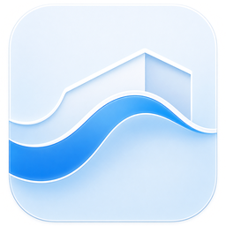

<h1 align="center">Float</h1>

<p align="center">
  
</p>

Float is a .NET container manager with an Avalonia UI, designed for the Apple Silicon ecosystem with Apple Containers.

## Features

- Container creation - create containers directly from the UI
- Migration - migrate existing containers from Docker Desktop. Note: Docker Desktop must stay open during migration.
- Private registry login
- Lightweight binary

## Stack

- .NET 10
- Avalonia 12
- Microsoft.Extensions.DependencyInjection
- CommunityToolkit.Mvvm

## Requisitos

- Apple Silicon machine running macOS 26+
- .NET 10 SDK

## Run

```bash
dotnet run --project src/Float.UI/Float.UI.csproj
```

## Build

```bash
dotnet build Float.slnx
```

## Project goal

The goal is to provide a lightweight experience for creating, viewing, and migrating containers, with a native UI and lower resource usage than a traditional desktop container stack.
